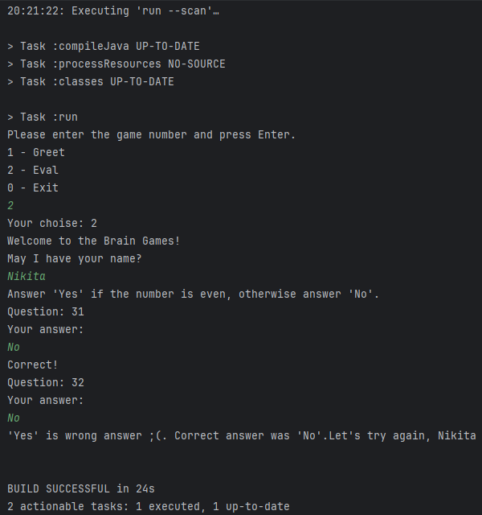
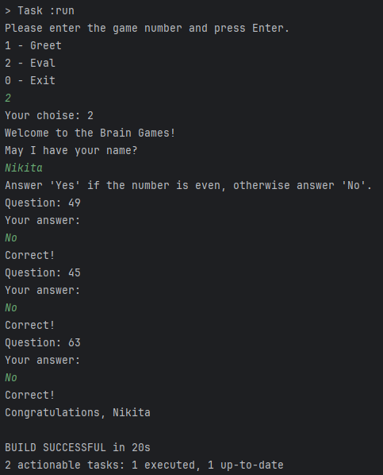
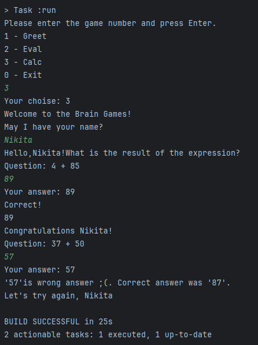
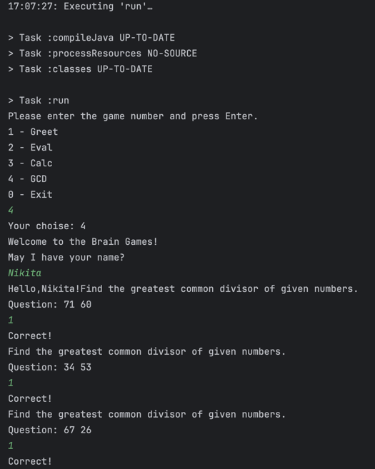
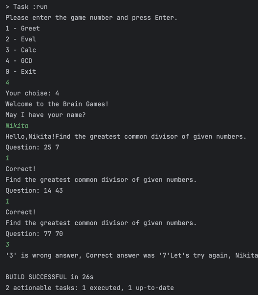
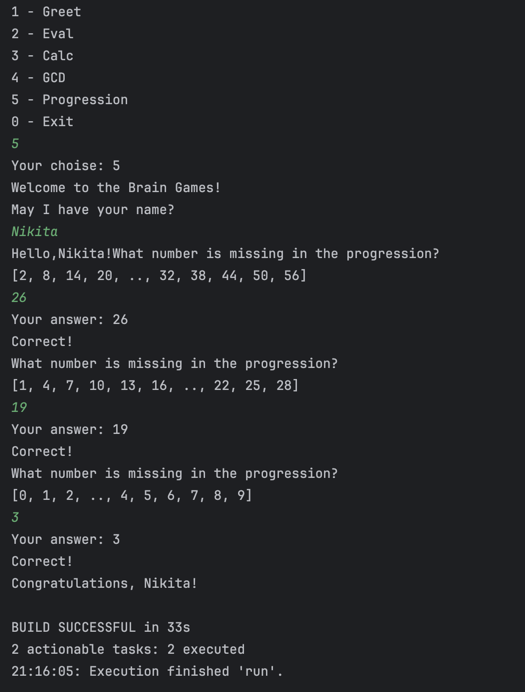
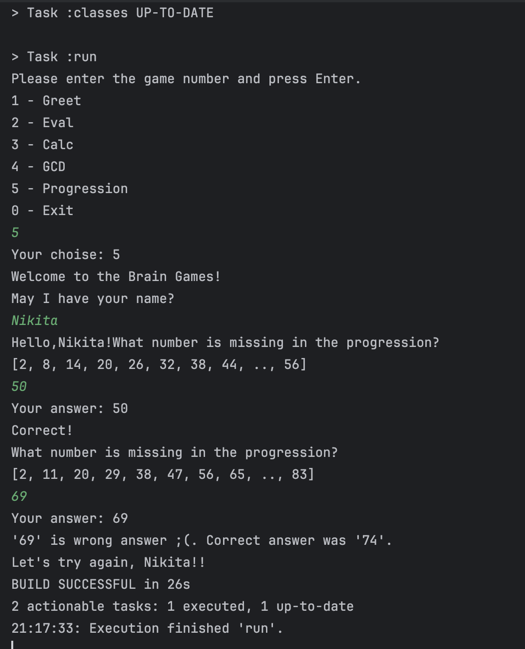
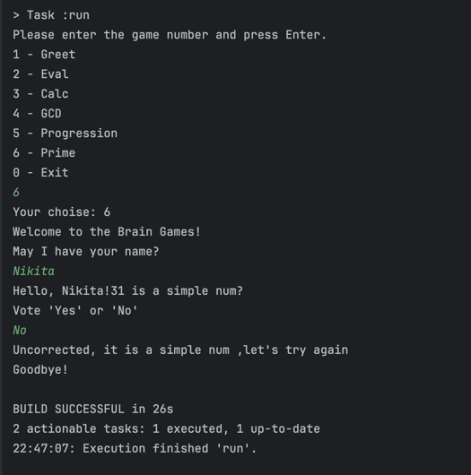
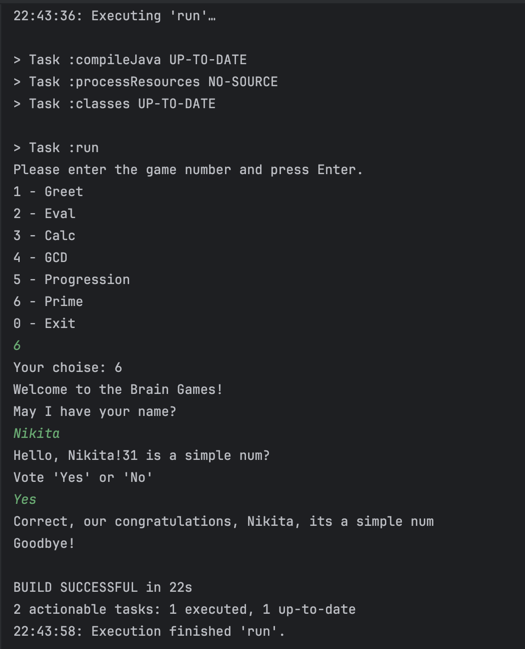

### Hexlet tests and linter status:

Eval
  - проигрыш

 - выигрыш

Calc
 - выигрыш

 - проигрыш

GCD
 - выигрыш

 - проигрыш

Progression
 - выигрыш

 - проигрыш

Prime
 - выигрыш

 - выигрыш